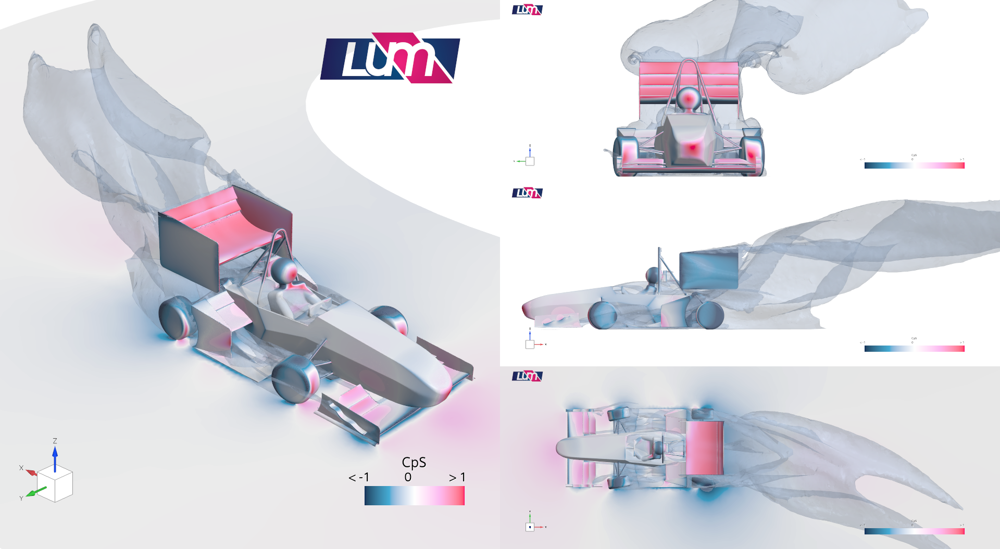

# Fully Parametric Dynamic Cornering CFD Simulation Environment

## 📌 Overview
Developed for the LUMotorsport Formula Student team, this project establishes a fully automated, native STAR-CCM+ simulation environment designed to evaluate vehicle aerodynamic performance under transient cornering states. By parameterising the entire domain and vehicle attitude within the solver, the framework eliminates unnecessary CAD rebuilds in Siemens NX and provides high-fidelity flow-field data across diverse dynamic conditions.

## ⚙️ Core Technical Architecture & Parameterization
Unlike standard straight-line setups, this environment is fully driven by parameterised runtime variables within STAR-CCM+:
* **Kinematic & Path Parameters:** Fully parameterised for corner radius, g-force experienced in the turn, steer angles, and global domain dimensions (height, width, length).
* **Dynamic Vehicle Attitude:** Manages full vehicle attitude changes including **roll, pitch, and yaw**. 
* **Automated Coordinate System Tracking:** As the vehicle attitude and steering angles update, all individual tyre coordinate systems, the centre of rotation, and the vehicle CG update dynamically and synchronously. 
* **Coordinate Transformation Maths:** To handle complex geometry shifts during steering and attitude adjustments, the framework relies on automated mathematical transformations—converting between **Cartesian and polar coordinate systems** natively inside the solver to ensure proper alignment of local tyre boundaries without manual intervention.

## 🧬 Advanced Mesh Strategy & Adaptive Mesh Refinement (AMR)
To maintain a clean and efficient workflow:
* **Elimination of Static Volumes:** Volumetric refinement regions are not built in CAD (Siemens NX), avoiding unnecessary bloat and rigid workflows.
* **Adaptive Mesh Refinement (AMR):** The simulation utilises AMR to dynamically track and resolve complex wake structures. The solver tracks **Q-criterion** and total pressure coefficient ($Cp_0$) gradients, concentrating mesh density precisely where turbulent structures and vortices evolve.

## 📊 Visualisation & Post-Processing Results

### Dynamic Cornering Overview & Flow Field

*Figure 1: Full-vehicle transient cornering simulation showing surface pressure ($Cp_s$) and wake structures mapped across a curved track geometry.*

### Pressure Coefficient ($Cp_s$) Layout

*Figure 2: Multi-angle breakdown of static pressure distribution across the chassis, front wing, and rear wing assembly during dynamic cornering.*

### Q-Criterion Wake Resolution (AMR)

*Figure 3: Isosurfaces of Q-criterion coloured by velocity magnitude, demonstrating the automated capture of tyre wakes, front wing Y-vortices, and rear wing tip vortices using Adaptive Mesh Refinement.*

## 🛠️ Software Stack
* **CFD Solver & Automation:** Simcenter STAR-CCM+ (Parametric fields, Java/Macro automation, AMR)
* **CAD Baseline:** Siemens NX

## 🏁 Engineering Impact
By consolidating geometry manipulation, coordinate transformations, and adaptive mesh refinement entirely within STAR-CCM+, this environment drastically reduces turnaround time for design iterations. It lets the team map how the aerodynamic centre of pressure shifts during high-g transient cornering, providing robust data to the vehicle performance team.
