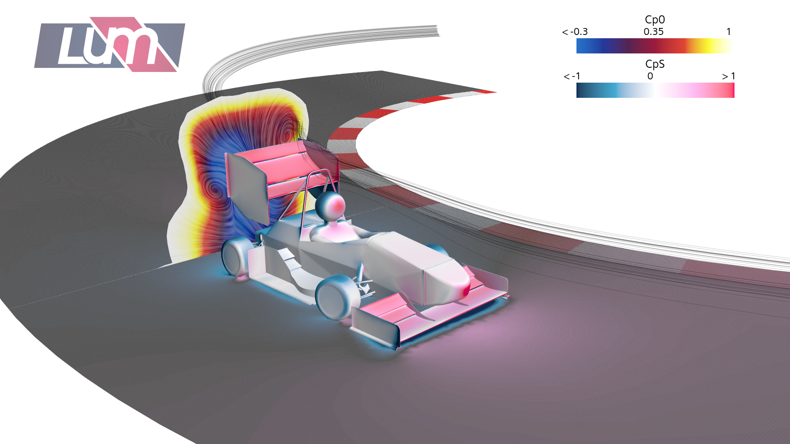
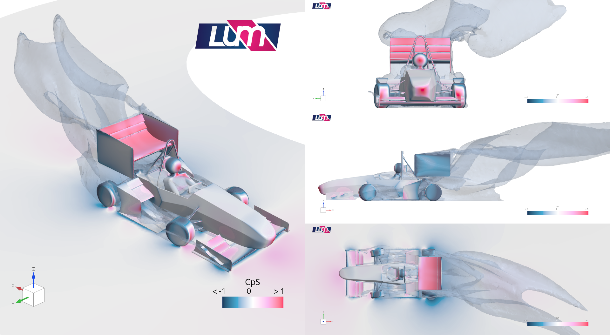
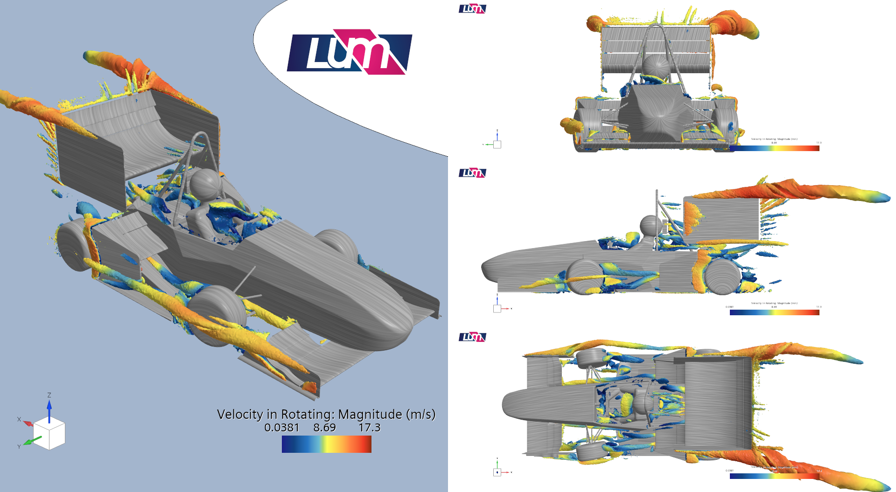

# Fully Parametric Cornering CFD Simulation

## Overview
Developed for the LUMotorsport Formula Student team, this project establishes a fully automated STAR-CCM+ simulation to evaluate vehicle aerodynamic performance during transient cornering. By parameterising the domain and vehicle attitude within the solver, the framework eliminates unnecessary CAD rebuilds in Siemens NX and provides high-fidelity flow-field data across a wide range of conditions.

## Architecture
This simulation is driven by parameterised variables within STAR-CCM+:
* **Dimensions and Kinematics:** Fully parameterised for corner radius, g-force experienced in the turn, steer angles, and global domain dimensions (height, width, length).
* **Dynamic Vehicle Attitude:** Manages full vehicle attitude changes including roll, pitch, and yaw. 
* **Coordinate System Tracking:** As the vehicle attitude and steering angles update, all individual tyre coordinate systems, the centre of rotation, and the vehicle CG update automatically. 
* **Coordinate Transformations:** To handle geometry shifts with steering and attitude adjustments, the framework uses coordinate system transforms that convert between Cartesian and polar coordinate systems to ensure the alignment of local tyre coordinate systems without manual intervention.

## Advanced Mesh Strategy & Adaptive Mesh Refinement (AMR)
To maintain a clean and efficient workflow:
* **Elimination of Static Volumes:** Volumetric refinement regions are not built in CAD (Siemens NX) to reduce complexity for the user and promote automation.
* **Adaptive Mesh Refinement (AMR):** The simulation utilises AMR to track and resolve complex wake structures. The solver tracks Q-criterion and total pressure coefficient ($Cp_0$) gradients, refining cells where turbulent structures and vortices evolve.

## Visualisation & Post-Processing Results

### Dynamic Cornering Overview & Flow Field

*Figure 1: Full-vehicle cornering simulation showing surface pressure* $Cp_s$ *and wake structures mapped across a curved track geometry.*

### $Cp_0$ Sweep Scene

https://github.com/user-attachments/assets/a0888b04-f9da-4690-8bc5-d15b7050765c

*Figure 2: Full-vehicle x-plane sweep of total pressure coefficient, highlighting vortex development and regions of loss.*

### Pressure Coefficient ($Cp_s$) Layout

*Figure 3: Multi-angle breakdown of static pressure distribution across all surfaces during cornering, with a* $Cp_0$ *isosurface.*

### Q-Criterion Wake Resolution

*Figure 4: Isosurfaces of Q-criterion coloured by velocity magnitude, demonstrating the automated capture of tyre wakes, front wing vortices and rear wing tip vortices using Adaptive Mesh Refinement.*

## Software
* **CFD:** Simcenter STAR-CCM+
* **CAD:** Siemens NX

## Impact
Having a fully automated cornering CFD simulation allows integration with the custom Multidisciplinary Design Optimisation (MDO) tool for efficient design optimisation, the ability to better inform Lap-Time Simulations (LTS) and therefore, the ability to better inform overall aerodynamic design targets. 
